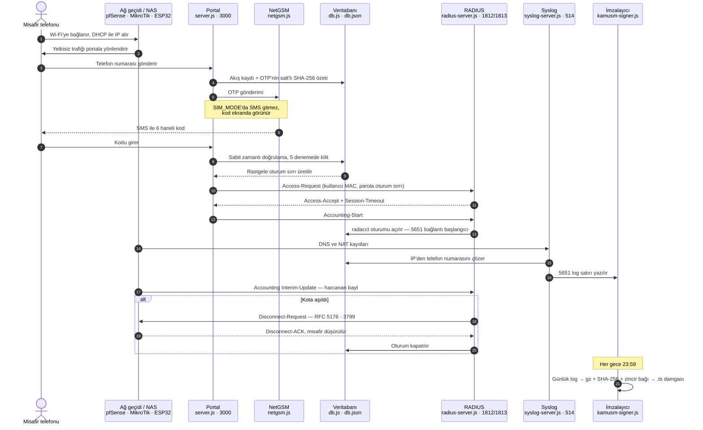

# pfSense-Native Captive Portal & SMS Entegrasyonu Simülasyon Rehberi

Bu proje, misafir kullanıcıların **yalnızca cep telefonu numaralarını (başında 0 olmadan)** girip NetGSM üzerinden gelen SMS OTP (tek kullanımlık şifre) kodu ile internete çıkış yapmasını sağlayan, **pfSense üzerinde koşan kurumsal Hotspot sisteminin** simülasyon ve kurulum altyapısıdır.

Saha kurulumunda kullanılacak olan Router (pfSense) ve Access Point (ESP32 Köprü) mimarisini %100 oranında taklit eder. T.C. Kimlik doğrulaması süreçleri devre dışı bırakılmış olup, sistem yalnızca yasal olarak yeterli olan SMS doğrulama adımlarına odaklanmıştır.

---

## 🗺️ Mimari — Uçtan Uca Akış

Misafirin telefonundan 5651 delil arşivine kadar tek bir yolculuk var. Aşağıdaki
diyagram, bu deponun her dosyasının o yolculukta nereye düştüğünü gösterir
(parantez içindekiler `backend/` altındaki dosyalardır).



**Diyagramın okunuşu:** portal yalnızca *kimlik* katmanıdır; internet erişimini açan
şey RADIUS'un `Access-Accept`'idir, delili üreten şey ise syslog + imzalama zinciridir.
Bu üçü birbirinden bağımsız çalışır — biri düşerse diğerleri kanıt üretmeye devam eder.
Misafiri *sınırlayan* katman hiçbiri değildir; o iş ağ geçidine aittir
([docs/AG-GECIDI-KURALLARI.md](docs/AG-GECIDI-KURALLARI.md)).

---

## ⚡ Hızlı Başlangıç — Donanımsız Uçtan Uca Demo (5 dakika)

Sahaya çıkmadan önce sistemin **tamamını tek bilgisayarda, ESP32/pfSense olmadan** çalıştırıp müşteriye kanıtlayabilir ve her katmanı öğrenebilirsiniz.

```bash
cd backend
npm install
cp .env.example .env        # Windows: copy .env.example .env  (SIM_MODE=true varsayılan)
node server.js              # 1. terminal: portal + RADIUS(1812/1813) + Syslog(514) + Cron
```

İkinci bir terminalde sanal misafir kalabalığı üretin:

```bash
cd backend
npm run simulate 6 3        # 6 sanal misafir, her biri 3 tur gezinsin
```

Sonra tarayıcıda:
- **Kontrol Paneli**: http://localhost:3000/dashboard — aktif oturumlar, canlı 5651 logu, adli arama, tek tuşla zaman damgası. **Yönetici girişi gerektirir** (SIM demosunda `admin` / `admin123` — konsolda da yazılır).
- **Misafir Portalı**: http://localhost:3000/captive — telefon → OTP → "Bağlantı Açık" akışını elle deneyin.

> `SIM_MODE=true` iken gerçek SMS gitmez (OTP ekranda görünür) ama arka planda **gerçek RADIUS paketleri** akar. Katmanları paket seviyesinde görmek için [docs/WIRESHARK-REHBERI.md](docs/WIRESHARK-REHBERI.md); üç simülasyon seviyesi (saf yazılım → ESP32 → pfSense) için [docs/SIMULASYON-REHBERI.md](docs/SIMULASYON-REHBERI.md).

Sahada gerçek SMS ve gerçek ağ geçidi için `backend/.env` içinde `SIM_MODE=false` yapıp NetGSM bilgilerinizi girin. **Üretim modunda** yönetici parolası, oturum sırrı ve (ESP32 kullanılıyorsa) paylaşılan sır `.env`'de tanımlı olmalıdır; eksikse sunucu başlamayı reddeder.

---

## 🔐 Güvenlik

Sistem, "saldırgan gözüyle" bir kod incelemesinden geçirildi; bulunan açıklar
kapatıldı ve her düzeltme otomatik bir saldırı testiyle kanıtlandı. Ayrıntılı
bulgu kaydı: [docs/GUVENLIK-DEGERLENDIRMESI.md](docs/GUVENLIK-DEGERLENDIRMESI.md).
Misafiri **sınırlayan** katman ağ geçididir (iç ağ izolasyonu, DNS zorlaması,
pfBlockerNG, kapatılacak portlar): uygulanabilir kural seti
[docs/AG-GECIDI-KURALLARI.md](docs/AG-GECIDI-KURALLARI.md) içinde — pfSense adımları
ve MikroTik komutlarıyla birlikte.

**Kapatılan açıklar:**

| Kod | Açık | Çözüm |
|---|---|---|
| F-01 | OTP kaba kuvvete açıktı (deneme sınırı yoktu) | Akış başına 5 deneme + `/verify-otp` hız sınırı |
| F-02 | SMS hız sınırı istemci MAC'iyle atlatılıyordu | Anahtar IP+telefona bağlandı, numara başına günlük tavan |
| F-03 | ESP32 yetkilendirmesi kimlik doğrulamasız GET'ti | HMAC-SHA256 imzalı POST + nonce/ts replay koruması |
| F-04 | RADIUS parolası MAC'in kendisiydi (spoof) | Rastgele oturum sırrı |
| F-06 | OTP `Math.random()` ile üretiliyordu | `crypto.randomInt`, hash'li saklama, sabit zamanlı karşılaştırma |
| F-07 | Kişisel veri süresiz saklanıyordu | Saklama temizliği (5651: 730 gün) |
| F-08 | Günlük imzalar birbirine bağlı değildi | `previousHash` hash zinciri + doğrulayıcı |
| F-12 | Yönetim API'si kimlik doğrulamasızdı (log silinebiliyordu) | Oturum tabanlı giriş; 5651 logu üretimde API ile silinemez |

**Kanıt komutları** (`backend/` içinde, sunucu çalışırken):

```bash
npm test                # birim testleri (db, auth, imza zinciri, doğrulama, hata katmanı)
npm run attack          # tüm saldırıları dener — hepsi "ENGELLENDI" olmalı
npm run verify-chain    # 5651 imza zincirini doğrular; silme/kurcalama tespit eder
npm run test:esp32      # ESP32 yetkilendirme protokolünü (imza/replay/stale) sınar
```

> **`npm run attack` sonrası giriş limiti:** A7 senaryosu bilerek 5 kez yanlış parola
> dener ve yönetici giriş limitini (15 dk / 5 **başarısız** deneme) doldurur. Bu yüzden
> hemen ardından `npm run simulate` veya panel girişi 429 alır; betik koşu sonunda bunu
> hatırlatır. İki çözüm: **sunucuyu yeniden başlatın** (limit bellekte tutulur) veya
> limiti hiç doldurmamak için:
>
> ```bash
> npm run attack -- --skip-a7
> ```
>
> Başarılı girişler sayaca yazılmaz, yani normal kullanım kendini kilitlemez.
>
> A8 (veri kotası) senaryosu yalnızca sunucuda kota açıkken çalışır:
> `QUOTA_MB=2 node server.js` ile başlatıp `npm run attack` çalıştırın.

`docs/attack-before.txt` düzeltme öncesi, `docs/attack-after.txt` düzeltme sonrası
çıktıdır — farkı yan yana gösterir.

**Bilinen sınırlar (dürüstçe):**
- **İmzalama simülasyondur.** `.ts` dosyaları gerçek RFC 3161 TSA yanıtı değil, mock
  HMAC'tir (`"mock": true` ile işaretli). Zincir yapısı (previousHash) gerçektir.
  Üretimde KamuSM TSA'ya `.tsq`/`.tsr` entegrasyonu gerekir.
- **Hız limiti profili** `radreply`'da üretilir ama Access-Accept paketine kodlanmaz
  (satıcıya özel öznitelik, sözlük gerektirir); fiili uygulama NAS tarafındadır.
- **ESP32 izin listesi** fiili trafik engellemesi yapmaz; L2 köprüde asıl uygulama
  ağ geçidinin (pfSense) işidir. Amaç yetkilendirme kanalının imzalı/replay'e kapalı olması.
- **Portal TLS'i** varsayılan kapalıdır (SIM demosu HTTP). Sahada `TLS_ENABLED=true` şarttır.
  Test/saha sertifikasını tek komutla üretebilirsiniz (ek bağımlılık yok, sistemdeki
  `openssl` kullanılır):

  ```bash
  cd backend
  npm run gen-cert                  # CN=localhost
  npm run gen-cert -- 192.168.20.1  # portal IP'sini de SAN'a ekler
  ```

  Ardından `.env` içine `TLS_ENABLED=true`, `TLS_KEY_PATH=certs/portal-key.pem`,
  `TLS_CERT_PATH=certs/portal-cert.pem` yazın. Kendinden imzalı sertifikada tarayıcı
  uyarı gösterir; müşteri kurulumunda gerçek CA (Let's Encrypt vb.) tercih edin.
- Firmware (`esp32-bridge.ino`) **gerçek ESP32 donanımında doğrulandı** (2026-09-03):
  imzalı istek kabul, imzasız/bozuk imza ret, replay (tekrar nonce) ret — beş testin
  beşi geçti (`docs/esp32-hw-test-sonuc.txt`). Yerel protokol testi de mevcut:
  `npm run test:esp32`.

---

## 📁 Dosya Yapısı ve Görevleri

* 📂 **`pfsense-files/` (pfSense İçine Yüklenecek Dosyalar):**
  * [radius.sql](file:///c:/Users/alper/OneDrive/Masaüstü/wifi-system/pfsense-files/radius.sql): pfSense üzerindeki yerel MySQL veritabanına import edilecek şema. Standart FreeRADIUS tabloları ile SMS doğrulama akış tablosunu içerir.
  * [captiveportal-config.php](file:///c:/Users/alper/OneDrive/Masaüstü/wifi-system/pfsense-files/captiveportal-config.php): MySQL veritabanı şifreleri, NetGSM API kullanıcı bilgileri, hız limitleri (Download/Upload) ve simülasyon modu ayarları.
  * [captiveportal-sms.php](file:///c:/Users/alper/OneDrive/Masaüstü/wifi-system/pfsense-files/captiveportal-sms.php): Arayüzden gelen AJAX isteklerini işleyen ana PHP dosyası. Rastgele şifre üretir, NetGSM ile SMS gönderir ve doğrulama sonrası `radcheck`/`radreply` tablolarına dinamik kayıt atarak kullanıcının internetini açar.
  * [index.html](file:///c:/Users/alper/OneDrive/Masaüstü/wifi-system/pfsense-files/index.html): pfSense Captive Portal'a yüklenecek, modern responsive tasarımlı (gold/dark temalı) SMS telefon giriş ve kod doğrulama ekranı.
  * [hata.html](file:///c:/Users/alper/OneDrive/Masaüstü/wifi-system/pfsense-files/hata.html): Doğrulama hatası oluştuğunda gösterilen şık hata sayfası.
* 📂 **`esp32-bridge/` (Access Point Yazılımı):**
  * [esp32-bridge.ino](file:///c:/Users/alper/OneDrive/Masaüstü/wifi-system/esp32-bridge/esp32-bridge.ino): ESP32 kartınızı şeffaf bir kablosuz köprüye (Bridge Access Point) dönüştüren Arduino C++ kodu.

---

## 💻 Windows Ana Bilgisayar Hazırlığı (Tek Tıkla Kurulum)

Sistemi simüle edebilmek için bilgisayarınızda VirtualBox, Arduino IDE, WinSCP ve PuTTY programlarının bulunması gerekir. Boş bir bilgisayarda bunların hepsini tek tıkla kurabilmeniz için bir yükleme scripti hazırladım:

1. **[install-prerequisites.bat](file:///c:/Users/alper/OneDrive/Masaüstü/wifi-system/install-prerequisites.bat)** dosyasına çift tıklayın.
2. Açılan ekranda onay vererek yükleme işlemlerini başlatın. Windows Paket Yöneticisi (`winget`) üzerinden arka planda tüm programlar otomatik olarak kurulacaktır.

---

## 🛠️ pfSense Sanal Makinesi Adım Adım Kurulum Rehberi

> **⚡ ÖNERİLEN TEST YOLU:** pfSense'i Node backend ile test etmek için bu bölümdeki
> **MySQL ve FreeRADIUS kurulumuna GEREK YOKTUR.** pfSense'in Captive Portal'ı doğrudan
> bilgisayarınızdaki Node RADIUS sunucusuna bağlanır; portal/SMS/5651/mühürleme Node
> tarafında çalışır. Adım adım kurulum: [docs/SIMULASYON-REHBERI.md — Seviye 2](docs/SIMULASYON-REHBERI.md).
> Aşağıdaki MySQL'li kurulum, Node olmadan tamamen pfSense üzerinde çalışan
> alternatif (bağımsız) senaryodur.

Simülasyonu başlatabilmek için bilgisayarınızda VirtualBox veya VMware üzerinde pfSense kurulu olmalıdır.


### Adım 1: Ağ Ayarları (Sanal Makine)
1. pfSense sanal makinenizin ayarlarına gidin.
2. **Ağ Sırdaşı (Adapter 1 - WAN):** `NAT` veya `Köprü Bağdaştırıcısı (Bridged)` seçerek internete çıkmasını sağlayın.
3. **Ağ Sırdaşı (Adapter 2 - LAN):** `Köprü Bağdaştırıcısı (Bridged)` seçerek bilgisayarınızın Wi-Fi kartına bağlayın (böylece ESP32 üzerinden gelen telefonlar pfSense LAN bacağına erişir).

### Adım 2: pfSense SSH Aktifleştirme ve Konsola Bağlanma
1. pfSense konsol arayüzünde **14 (Enable Secure Shell - SSHD)** seçeneğiyle SSH'ı açın.
2. Bilgisayarınızdan PuTTY veya terminal kullanarak bağlanın (`ssh root@<pfsense_lan_ip>`).
3. Konsol menüsünden **8 (Shell)** seçerek FreeBSD komut satırına geçiş yapın.

### Adım 3: pfSense Üzerine Veritabanı ve PHP Kütüphanelerini Kurma
FreeBSD repo ayarlarını düzenlemek için sırayla şu komutları çalıştırın:
```bash
# Nano editörünü kurun
pkg install -y nano

# pfSense ve FreeBSD repolarını aktif edin (enabled: no parametrelerini enabled: yes yapın)
nano /usr/local/etc/pkg/repos/pfSense.conf
nano /usr/local/etc/pkg/repos/FreeBSD.conf

# Paket listesini güncelleyin
pkg update

# MySQL Server, PHP ve OpenSSL bağımlılıklarını kurun
pkg install -y mysql80-server compat9x-amd64 php82-mysqli php82-soap openssl

# MySQL'i başlangıca ekleyin ve servisi başlatın
echo 'mysql_enable="YES"' > /etc/rc.conf
mv /usr/local/etc/rc.d/mysql-server /usr/local/etc/rc.d/mysql-server.sh
/usr/local/etc/rc.d/mysql-server.sh start
```

### Adım 4: MySQL Güvenlik Yapılandırması ve Veritabanı Kurulumu
1. MySQL kurulumunu tamamlamak için komutu çalıştırın:
   ```bash
   /usr/local/bin/mysql_secure_installation
   ```
   *İlk soruda root şifrenizi belirleyin, diğer güvenlik adımlarını varsayılan ayarlarla (Y/Enter) geçin.*
2. MySQL konsoluna bağlanın:
   ```bash
   mysql -u root -p
   ```
3. Root şifresinin süresinin dolmaması için aşağıdaki SQL'i çalıştırın ve `radius` veritabanını oluşturun:
   ```sql
   ALTER USER 'root'@'localhost' IDENTIFIED BY 'belirlediginiz_sifre', 'root'@'localhost' PASSWORD EXPIRE NEVER;
   CREATE DATABASE radius;
   exit
   ```
4. WinSCP veya benzeri bir FTP programı ile bilgisayarınızdaki `pfsense-files/radius.sql` dosyasını pfSense içinde `/root/` altına yükleyin.
5. Veritabanı tablolarını import edin:
   ```bash
   mysql -u root -p radius < /root/radius.sql
   ```
6. **Güvenlik Uyarısı:** Kurulum bittikten sonra `/usr/local/etc/pkg/repos/` altındaki `pfSense.conf` ve `FreeBSD.conf` dosyalarındaki `enabled: yes` değerlerini tekrar `no` haline getirin ve `pkg update` komutunu çalıştırın.

---

## 🌐 pfSense Web UI ve Servis Yapılandırmaları

Kurulumları tamamladıktan sonra pfSense Web arayüzüne (tarayıcıdan LAN IP'sini yazarak) admin şifrenizle giriş yapın.

### 1. FreeRADIUS Kurulumu ve SQL Bağlantısı
1. **System > Package Manager > Available Packages** kısmından `freeradius3` paketini bulun ve kurun.
2. **Services > FreeRADIUS > NAS/Clients** sekmesine gidin. Add diyerek Client IP: `127.0.0.1`, Client Shared Secret: `<RADIUS_SECRET_DEGERINIZ>` girin ve kaydedin
   (bu değer `backend/.env` içindeki `RADIUS_SECRET` ile birebir aynı olmalıdır).
3. **Services > FreeRADIUS > Interfaces** sekmesine gidin. Add diyerek Port 1812 (Authentication) ve Port 1813 (Accounting) için interface ekleyin. IP adresi olarak `127.0.0.1` seçilmelidir.
4. **Services > FreeRADIUS > SQL** sekmesine gidin. `Enable SQL` kutusunu işaretleyin. Database: `MySQL`, Server: `localhost`, Port: `3306`, User: `root`, Password: `<mysql_sifreniz>`, DB Name: `radius` yazarak kaydedin.

### 2. Captive Portal (Hotspot Zonu) Oluşturma
1. **Services > Captive Portal** alanına girin. Add diyerek bir zone ekleyin (örn: Misafir_Agi).
2. `Enable Captive Portal` kutusunu işaretleyin.
3. **Authentication:** `RADIUS Authentication` seçin. Authentication Server olarak oluşturduğumuz FreeRADIUS sunucusunu belirtin.
4. **Redirection (Yönlendirme):** `Use custom captive portal login page` seçeneğini aktif edin.
   - **Portal page contents:** Bilgisayarınızdaki `pfsense-files/index.html` dosyasını seçin.
   - **Auth error page contents:** Bilgisayarınızdaki `pfsense-files/hata.html` dosyasını seçin.
5. Sayfayı kaydedin.
6. **Dosya Yükleme (File Manager):** Captive Portal ayarlarının en üstünde yer alan **File Manager** sekmesine gidin. Buradan aşağıdaki iki dosyayı tek tek yükleyin:
   - `captiveportal-config.php` (Yüklemeden önce içindeki MySQL root şifrenizi düzenlediğinizden emin olun!)
   - `captiveportal-sms.php`

---

## 📱 İstemci (Telefon) ve ESP32 Test Adımları

1. **ESP32'yi Çalıştırın:** `/esp32-bridge/esp32-bridge.ino` kodunu Arduino IDE ile ESP32 kartınıza yükleyin. Kart `Restoran_Misafir_Wifi` adında şifresiz bir ağ yayacaktır.
2. **Bilgisayarı Wi-Fi Ağına Bağlayın:** pfSense sanal makinenizin çalıştığı bilgisayarın Wi-Fi kartını bu ağa bağlayın. pfSense LAN bacağı bu kart üzerinden IP alacaktır.
3. **Telefonu Wi-Fi Ağına Bağlayın:** Test etmek istediğiniz akıllı telefonu `Restoran_Misafir_Wifi` ağına bağlayın.
4. **Captive Portal Karşılaması:** Telefon bağlandığı anda pfSense DHCP üzerinden IP atayacak ve otomatik olarak "Ağa Katıl" tarayıcı ekranını açıp `index.html` karşılama sayfasını getirecektir.
5. **SMS Doğrulama Testi:**
   - Telefon numarasını `5XXXXXXXXX` formatında girin.
   - **Simülasyon Modu Aktifse (Varsayılan):** SMS gitmez, şifre ekranda ve pfSense içinde `/var/log/captiveportal_sms.log` dosyasında belirir. Bu şifreyi girerek giriş yapabilirsiniz.
   - **Simülasyon Modu Kapalıysa:** NetGSM API'si tetiklenir ve telefona gerçek SMS gider. Şifreyi girip doğruladıktan sonra internet erişiminiz aktifleşir.
